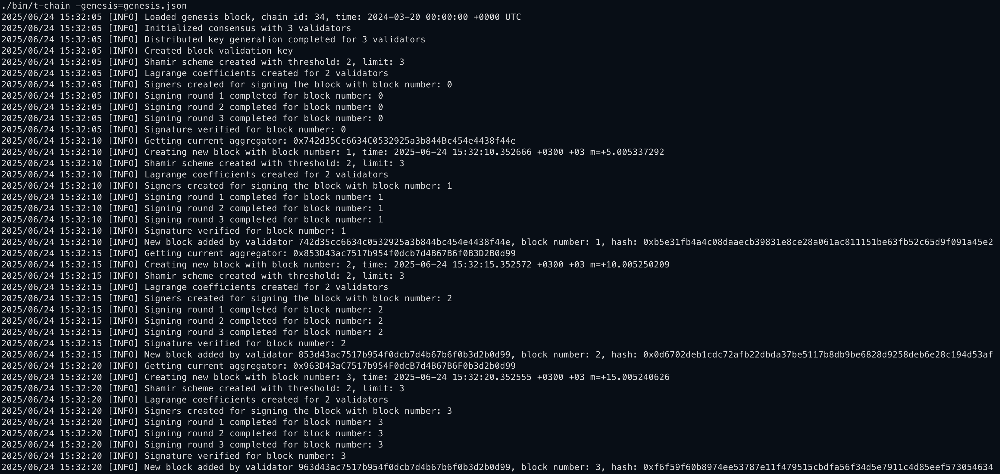

# T-Chain: Simple Blockchain with Threshold EdDSA-Based Consensus Mechanism

Blockchain systems rely on distributed consensus to agree on the order and content of blocks added to the chain. Traditional consensus protocols, such as `Proof of Work (PoW)` or `Byzantine Fault Tolerance (BFT)`, often suffer from scalability, performance, and energy efficiency issues.

This project proposes an alternative approach using threshold cryptography, specifically `FROST` (Flexible Round-Optimized Schnorr Threshold Signature), to enable an efficient and secure consensus mechanism that requires only a subset of validators to sign each block. The system is implemented as a blockchain simulator in `Go (Golang)`, with features such as validator rotation and block aggregation.

## Background and Motivation

Consensus in distributed systems is challenging in the presence of network delays, adversarial nodes, and scalability demands. Traditional `BFT` protocols are secure but incur high communication complexity. `PoW` and `PoS` rely on economic incentives but have their own trade-offs in energy consumption and fairness.

Threshold signatures allow a subset of authorized participants (e.g., 2 out of 3 validators) to collaboratively generate a valid signature without revealing their individual secrets. This makes threshold signatures a compelling solution for improving the efficiency and robustness of consensus protocols.

FROST, a recent advancement in threshold `Schnorr` signatures, offers a low-latency, two-round protocol for threshold signing. It combines cryptographic strength with practical efficiency, making it suitable for use in blockchain consensus.

## Objectives

- Build a blockchain simulator using Golang.

- Implement a threshold consensus mechanism based on `FROST`.

- Require only t-of-n validators to sign each block (e.g., 2-of-3).

- Enable rotating validator sets.

- Simulate block creation, signing, verification, and chain growth.

- Provide logging mechanism.

## System Architecture

### Blockchain Structure

- Blocks are created every 5 seconds.

- Each block includes:
    - Block header
    - Block hash
    - List of transactions

- Each Header Includes:
    - Block Number
    - Timestamp
    - Chain ID
    - Block Aggregator
    - List of current validators
    - Header Hash
    - Previous block hash

- Finally, each signed block has:
    - Block
    - Block signature
    - Block aggregator

### Validators

- Each validator holds a private share of the secret key.

- Validators participate in signing based on `FROST` protocol.

- An aggregator node collects signature shares and finalizes blocks.

### Consensus Mechanism

- An aggregator is selected for the current block.

- Transactions are collected by the aggregator.

- Selected validators perform the two-round `FROST` signing protocol.

- Aggregator assembles a valid threshold signature.

- Block is verified and appended to the blockchain.

## FROST: Flexible Round-Optimized Schnorr Threshold Signatures

### Overview
`FROST` is a two-round threshold Schnorr signature protocol that enables multiple parties to collaboratively sign a message, producing a single `Schnorr` signature.

### Protocol Phases

#### Key Generation

- Can be done via `Distributed Key Generation (DKG)` or trusted dealer.

- Validators receive a share of the secret key.

- All validators know the group public key.

#### Signing Rounds

- `Round 1`: Validators generate nonce commitments and broadcast them.

- `Round 2`: After collecting commitments, each validator generates a signature share.

- The aggregator collects signature shares and uses Lagrange interpolation to compute the final signature.

### Advantages
- Two-round efficiency.

- Strong unforgeability (`EUF-CMA` secure).

- Safe against rogue-key attacks.

- Enables concurrency and parallel sessions.

## Implementation

### Technologies Used

- Language: Go

- Crypto Library: `Coinbase Kryptology Library`

- Concurrency: Goroutines and channels

- Hashing: `SHA-256`, `Keccak256` (for Ethereum-style addresses)

### Project Modules

- `core`: This module is define the core structural elements of the blockchain.

- `core/blockchain.go`: blockchain.go is the place where blocks added to the blockchain. At the beginning of the blockchain, blockchain.go lets us to load a genesis for the initialization. 

- `core/types`: This module includes the blockchain's core types such as blocks, transactions, transaction pool, accounts.

- `crypto/frost`: This module contains DKG and FROST specific functions.

- `crypto/crypto.go`: It contains general crypto tools such as hash algorithms.

- `consensus`: Coordinates block creation and signing.

- `common`: Includes common types such as Address and Hash.

- `cmd/t-chain`: Entry point; manages initialization and block loop.

## CLI Outputs

## Limitations

While this project implements validator rotation and epoch-based consensus logic, it does not currently include epochal key resharing/refreshing, a critical feature in robust threshold cryptographic systems.

The reason why epochal key resharing was not implemented in this project is due to the lack of a fully decentralized, dealerless resharing mechanism for FROST. While FROST supports efficient threshold signing, it currently does not offer a standard, production-ready protocol for resharing secret key shares. Even if Zcash Foundation implement a resharing mechanism for frost it requires trusted dealers and it is implented in `Rust` language. Resharing implementation of Zcash Foundation is [here](https://github.com/ZcashFoundation/frost/blob/main/frost-core/src/keys/refresh.rs)

In the absence of such a protocol, implementing epochal resharing would require either:
- Introducing a trusted dealer, which contradicts the decentralization goals of the project, or
- Designing a custom Distributed Key Resharing (DKR) scheme, which is out of scope for this implementation.

As a result, validators in this system retain their initial key shares across all epochs, and key material is not refreshed over time. This limitation is acknowledged and marked as a direction for future improvement.

**What Is Epochal Key Resharing?**

Epochal key resharing refers to the process of generating fresh secret shares for each validator at the beginning of every epoch, while keeping the group public key unchanged. This prevents long-term exposure of key shares and improves resilience against adaptive adversaries who may compromise validators over time.

**Impact on This Project**

In this implementation:
- Key generation is performed once at genesis.
- Validators reuse the same private key shares across all epochs.
- As a result, validator rotation is logically supported but cryptographically static.

This is a known limitation and should be addressed in future work by integrating Distributed Key Resharing (DKR) protocols, such as:
- FROST resharing extensions
- Verifiable Secret Sharing (VSS) with resharing capability

## Future Work

- Support for dynamic validator sets and key resharing.

- Support epochal key resharing and distribution.

- Integration with `Ethereum` smart contracts to verify block signatures.

- Implement completed blockchain network.

## Conclusion

This project demonstrates the viability of using threshold cryptography, specifically `FROST`, to achieve efficient, decentralized, and fault-tolerant consensus in blockchain systems. The Golang-based simulator showcases key features such as block signing, validator rotation, and consensus enforcement using a 2-out-of-3 threshold. The design opens doors for scalable and secure blockchain infrastructure in both public and permissioned environments.

## References

- FROST paper: https://eprint.iacr.org/2020/852.pdf
- FROST Author's implementation: https://git.uwaterloo.ca/ckomlo/frost/
- Coinbase Kryptology Library: https://github.com/coinbase/kryptology
- https://github.com/ZcashFoundation/frost
- ZK Podcast Episode 318: https://zeroknowledge.fm/podcast/318/
- Chelsea Komlo's UCL Presentation: https://www.youtube.com/watch?v=ReN0kMzDFro
- Dfinity's Internet Consensus Protocol paper: https://dfinity.org/presentations/podc-2022-cr.pdf